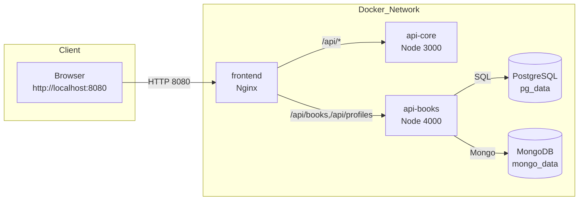

```mermaid
flowchart LR
    subgraph Client
      B[Browser<br/>http://localhost:8080]
    end

    subgraph Docker_Network
      F[frontend<br/>Nginx]
      A1[api-core<br/>Node 3000]
      A2[api-books<br/>Node 4000]
      PG[(PostgreSQL<br/>pg_data)]
      MG[(MongoDB<br/>mongo_data)]
    end

    B -->|HTTP 8080| F
    F -->|/api/*| A1
    F -->|/api/books,/api/profiles| A2

    A2 -->|SQL| PG
    A2 -->|Mongo| MG
```

